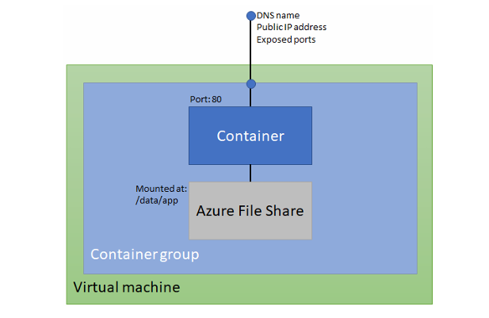

Azure Container Instances for serveless Containers

En 2017 fue integrado este servicio en Azure gracias a la famosa llegada del serverless. Este servicio es utlizado para multitud de arquitecturas.

- Entendiendo Azure Container Instances

Este servicio ha sido creado para promover soluciones a aplicaciones cloud-native. ACI (Azure Container Instance) es una solución para correr tus contenedores de una forma aislada y segura, estos contenedores correrian en una maquina virtual donde no te harías cargo del hardware, del sistema operativo, del patching etc

Esta solución corre tanto contenedores Linux como Windows.

Una cosa a destacar es que ACI, no solo puedes integrarlo con infinidad de recursos en Azure, si no que también puedes integrarlo con comandos de Docker CLI, es decir, con un comando como "docker run" puedes hacer correr un contenedor en ACI.

- Infraestructura
 Containers groups: Los grupos de contenedores actuan como si fueran pods dentro del kubernetes. Son grupos de contenedores que comparten red, storage y namespaces, ademas de que se pueden ver entre sí, siempre y cuando corran en el mismo grupo de contenedores. Que esten en el mismo grupo de contenedores, significa que los contenedores corren en la misma maquina virtual. 

 Este seria un ejemplo de lo que se crearía:

 

 ¿Como funcionan los recursos dentro de esta maquina virtual?

 Segun la región, la maquina virtual que va a correr tus contenedores puede tener limites de CPU y memoria, por regla general, no puede tener mas de 4 vCPU y 16 GB de Memoria. Esto quiere decir que los contenedores que esten corriendo dentro de esa maquina virtual no pueden consumir mas de esos recursos.

 Para ello se establecen request and limits en los contenedores, que haces mas manejable y facil la convivencia de contenedores sin que se perjudiquen por los recursos. Si metes dos contenedores que tienen un request de 1 CPU y 3 GB de memoria, la maquina virtual alojará 2 CPU y 6 GB de memoria y pagarás por eso. Como buena práctica, es importante dejar siempre margen de recursos en la maquina virtual, no saturarla con los contenedores.

 - Networking

Cuando crear un ACI normalmente se exponen public endpoints para exponer tu contenedor hacia el exterior. Esto puede cambiar, puede implementarle una VNET de azure para hacerlo privado, asi será mas facil la comunicación entre servicios dentro de Azure. Por ejemplo, esta implementacion viene bien si se tiene una aplicacion donde el frontend esta corriendo en una Web App y la SQL esta corriendo en el servicio SQL de azure, nos conviene tener el backend en el ACI en una VNET privada de Azure

La limitación aquí, es que no puede estar privado y externo a la vez, en cuanto metemos nuestro ACI en una VNET de azure, pierde el acceso al public endpoint. Esto se puede arreglar utiliando alguna implementación de Azure relacionada con redes.

- Utilizarlo con Azure Kubernetes Service

Imagina que tienes una aplicacion e-commerce que tienes ventas, normalmente sabes cuanta carga tiene tu aplicación, pero al llegar Navidades, tienes una carga muy alta en un periodo de tiempo muy muy corto, no te da tiempo a escalar tu aplicación y tampoco quieres implementar mas maquinas para soportarla por que las estarías desaprovechando en los otros periodos del año. Esto se puede solucionar usando ACI como servicio de Kubelet. Desde tu cluster de Kubernetes, cuando llegue navidades, puedes integrarlo con ACI para que kubernetes mande a crear Azure Containers para que empiecen a trabajar, una vez que la carga a la aplicación se reduzca Kubernetes escalará hacia abajo tu aplicación automaticamente. 

