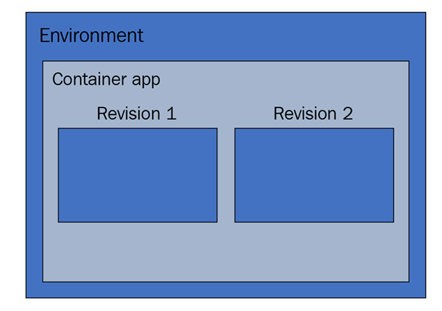

# Azure Container Apps for Serverless Kubernetes

Azure Container Apps (ACA), lanzado en noviembre de 2021, es un servicio serverless de Azure diseñado para ejecutar contenedores. Este servicio es manejado por Kubernetes, pero con la particularidad de que el clúster es administrado por Microsoft, permitiéndote concentrarte únicamente en tus contenedores.

ACA utiliza varias herramientas open-source como KEDA, Dapr y Envoy (Ingress Nginx). Aunque no es necesario gestionar estos componentes directamente, es importante conocer su uso. Además, al crear un ACA, obtendrás un FQDN (Fully Qualified Domain Name) que puedes personalizar con tu propio dominio y certificado.

---
 
## Componentes del Servicio

### Environment
- Los **environments** son unidades de agrupación donde se despliegan los ACA. 
- Funcionan de forma similar a los Namespaces en Kubernetes.
- Comparten **VNET** y **Log Analytics Workspace** en Azure.
- Se recomienda agrupar en un mismo environment los ACA que estén relacionados entre sí por conexiones o funcionalidad. En caso contrario, deberían separarse en diferentes environments.
- **Nota**: No se paga por los environments creados, solo por los ACA desplegados.

---

### Revisions
- Una **revision** puede gestionar uno o varios contenedores.
- Cada cambio en el ACA genera una nueva revision, encargada de implementar la nueva configuración o imagen y mantener el ACA activo.
- Similar a los ReplicaSets en Kubernetes.

#### Cambios que generan una nueva revision:
1. Actualización de la imagen.
2. Adición de reglas de escalado con KEDA.
3. Cambios en la configuración de Dapr.
4. Modificaciones en la plantilla del contenedor.

#### Cambios que **no** generan una nueva revision:
1. Modificación de reglas o activación/desactivación de Ingress.
2. Cambios en los valores de los secretos.
3. Cualquier cambio fuera de la plantilla del contenedor.

---

### Contenedores
#### Características destacadas:
1. Se puede ejecutar cualquier tipo de imagen siempre que sea **Linux-based x86/64** (linux/arm64).
2. Solo están disponibles los puertos **80** y **443** para exponer aplicaciones.
3. Si un contenedor falla, ACA lo reinicia automáticamente.

---

## Infraestructura

La infraestructura de ACA se organiza de la siguiente manera:

---

## Pros y Contras

### Pros:
1. **Rapidez**: ACA permite ejecutar contenedores en segundos con pocos comandos. Ideal para pruebas rápidas.
2. **Microservicios**: Perfecto para aplicaciones divididas en múltiples contenedores en entornos independientes.
3. **Mayor control**: Flexibilidad en las reglas de entrada/salida mediante Ingress, con monitoreo individual para cada contenedor.
4. **Soluciones cloud nativas**: Herramientas como KEDA y Dapr optimizan el escalado y la integración en la nube, reduciendo costos.

### Contras:
1. **En preview**: El servicio aún está en fase de prueba.
2. **Puertos internos limitados**: Solo se pueden usar los puertos **80** y **443**, lo que complica la conexión entre contenedores que utilicen otros puertos.
3. **Cold start**: Como cualquier servicio serverless, los tiempos de arranque inicial pueden ser lentos.
4. **Falta de YAML/JSON**: La ausencia de lenguajes estándar como YAML/JSON dificulta la migración a Kubernetes, requiriendo tareas manuales.

---

Azure Container Apps ofrece una solución flexible y eficiente para ejecutar contenedores en un entorno serverless, con características que potencian los microservicios y reducen la complejidad operativa. Sin embargo, sus limitaciones actuales requieren consideración al elegirlo como plataforma para aplicaciones críticas.
